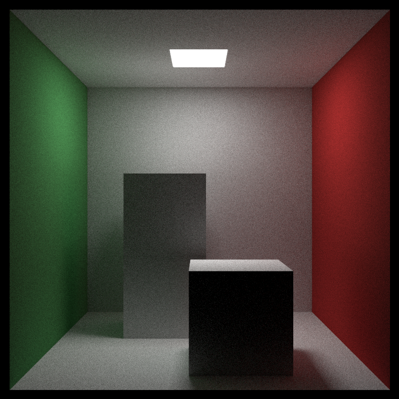

# Ray Tracing 

## Test Results

## Notes

reference:

- https://github.com/RayTracing/raytracing.github.io
- Fundamentals of Computer Graphics, Fourth Edition by Marschner, Steve Shirley, Peter

requirements:

- cmake
- c++ 20 compiler

library dependencies:

- glm : vector and matrix(*column major*) data types, linear algebra algorithms
- stb_image/stb_image_write : read/write image
- assimp : import 3D model
- boost
- [indicators](https://github.com/p-ranav/indicators)
- [catch2](https://github.com/catchorg/Catch2)

